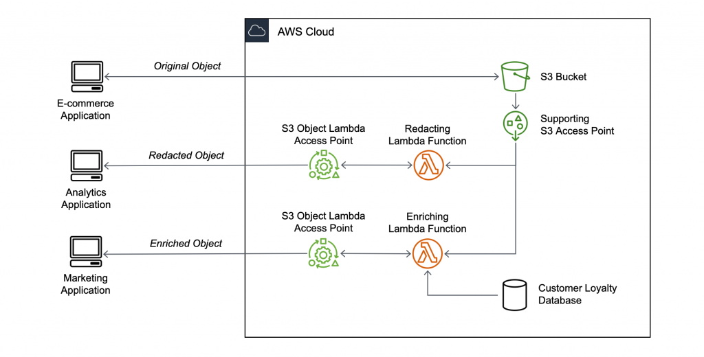

# Amazon S3 Object Lambda Access Points
- Use _AWS Lambda Function_ to change the object before it is retrieved by the caller application
- Only one S3 bucket is needed, on top of which we create _S3 Access Point_ and _S3 Object Lambda Access Points_

## Use-cases
- Redacting PII for analytics or non-prod envs
- Converting data formats (XML -> JSON)
- Augmenting data with information form other services (DB)
- Compressing/decompressing files as they are being downloaded
- Resizing and watermarking images on the fly using caller-specific details
- Implementing custom auth rules to access data

# Documentation
- [AWS Documentation: Creating Object Lambda Access Points](https://docs.aws.amazon.com/AmazonS3/latest/userguide/olap-create.html)
- [Introducing Amazon S3 Object Lambda – Use Your Code to Process Data as It Is Being Retrieved from S3](https://aws.amazon.com/blogs/aws/introducing-amazon-s3-object-lambda-use-your-code-to-process-data-as-it-is-being-retrieved-from-s3/)

# Useful commands

! Please note that this cdk application contains a Lambda. It is build during `cdk deploy`. The configuration is stored in `cdk.json/app`.

* `npm run build`   compile typescript to js
* `npm run watch`   watch for changes and compile
* `npm run test`    perform the jest unit tests
* `cdk deploy`      deploy this stack to your default AWS account/region
* `cdk diff`        compare deployed stack with current state
* `cdk synth`       emits the synthesized CloudFormation template